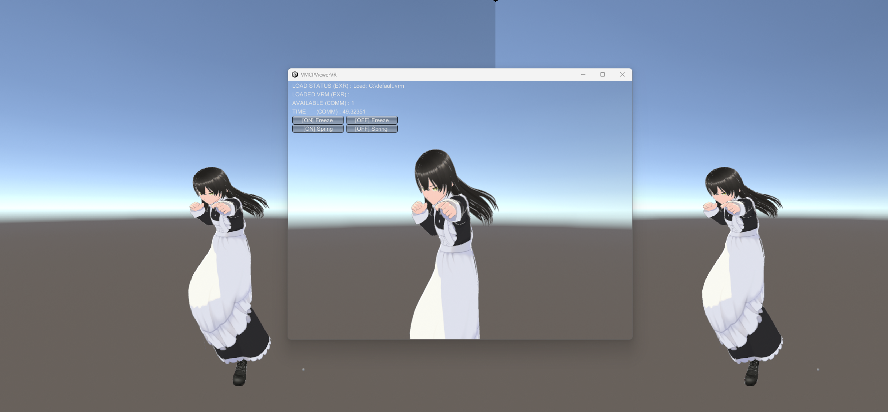

# VMCPViewerVR
VRMを読み込み、[VMCProtocol](https://protocol.vmc.info/)経由で送られてきた姿勢を反映し、VRゴーグルで鑑賞するためのソフトです。

## 主なコード
https://github.com/gpsnmeajp/VMCPViewerVR/blob/main/Assets/GameMaster.cs

## 使い方
+ VMCPViewerVR.vrmあるいはdefault.vrmをCドライブ直下(または、ドキュメント直下、あるいはカレントフォルダ)に置いて起動
+ ポート 39539で待ち受けてるので何らかのソフトで送る。(推奨 & 動作確認済み: https://store.steampowered.com/app/1895630/VRM/ )
+ トリガーを押すと、コントローラの位置を、アバターの起点位置にする

多分下記の色々なPerformerのソフトが使えるはずです。  
https://protocol.vmc.info/Reference

